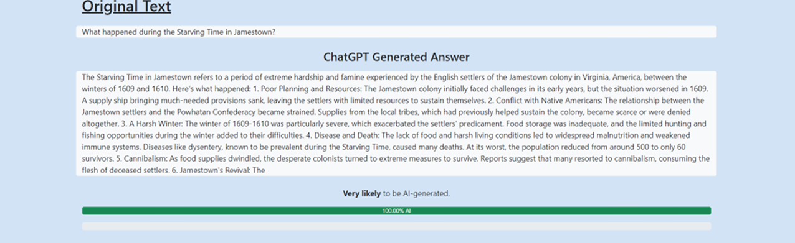

# AttackGPT
AttackGPT is a web application designed to **explore the impacts of adversarial attacks on GPT-3.5 text prompts and evaluate the
robustness and reliability of ChatGPT**, an AI model designed for conversational interactions. 

The application provides a user-friendly interface for 
- Prompt selection
- Attack execution
- Result analysis

2 different **types of attacks** can be performed: 
- 4 existing attacks from the TextAttack framework
- A self-developed Bias Attack

---
### Step-by-Step Walkthrough of the Web Application: 

### Section to Enter Prompt and Choose the Type of Attack to Execute:

### Example of Text Attack Result Page:

---
To view an example of a Bias Attack result page, download this file and open it in a web browser:
[Bias Attack Result Page Example](downloaded_results.html)

Detailed user guides and test reports are provided in this file: 
[User Guides and Test Report](User-guides-test-report.pdf)

If you wish to learn more about the project methodologies and outcomes, refer to this file:
[Final Project Report](Final-Project-Report.pdf)

## Note:
The implementation and evaluation of the adversarial attacks are not currently feasible since the API key for the GPT-3.5 model has expired. 

> This application was part of a final-year project, which was collaboratively developed by a team of 3 students, guided by the expertise of 3 supervisors.
